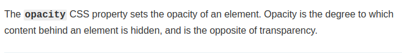

# Cheetah Hover


- Link of the project: https://kevschmidt.github.io/cheetah-hover/
- Clone the repository: ``` git clone git@github.com:kevSchmidt/cheetah-hover.git ```

### Tools:
<h1>

</h1>

### Preview:


### Training with CSS positions

#### z-index


#### opacity



#### :hover


#### position


